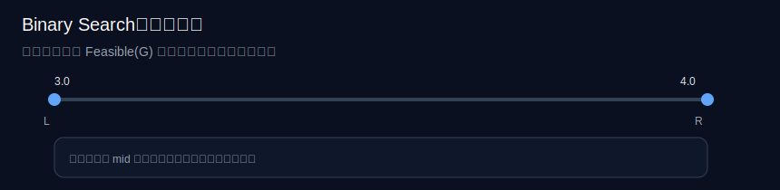
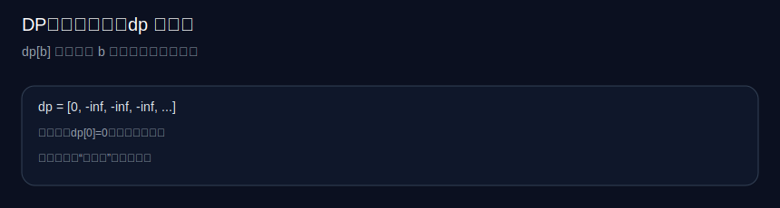
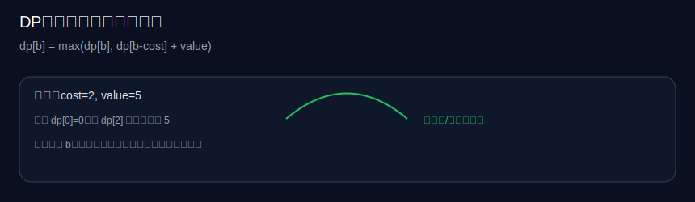

# 算法讲解（系统性扩展版）

本页面向两类读者：

- 想理解“为什么这套规划有效、什么时候会失效”的使用者（国际学校学生/家长）
- 想把算法做成可测试、可扩展、可解释的工程实现的开发者

本文保持与现有页面一致的风格：先讲直觉，再讲数学与推导，最后落到可执行代码与边界处理。

## 目录

- [0. 问题建模](#0-问题建模)
- [1. 贪心规划（Greedy Allocation）](#1-贪心规划greedy-allocation)
  - [1.1 核心思想与适用场景](#11-核心思想与适用场景)
  - [1.2 数学原理与推导](#12-数学原理与推导)
  - [1.3 复杂度分析](#13-复杂度分析)
  - [1.4 可视化步骤](#14-可视化步骤)
  - [1.5 边界与异常](#15-边界与异常)
  - [1.6 工业级优化](#16-工业级优化)
  - [1.7 实战题（3 题）](#17-实战题3-题)
- [2. 二分答案（Binary Search on Answer）](#2-二分答案binary-search-on-answer)
  - [2.1 核心思想与适用场景](#21-核心思想与适用场景)
  - [2.2 数学原理与推导](#22-数学原理与推导)
  - [2.3 复杂度分析](#23-复杂度分析)
  - [2.4 可视化步骤](#24-可视化步骤)
  - [2.5 边界与异常](#25-边界与异常)
  - [2.6 工业级优化](#26-工业级优化)
  - [2.7 实战题（3 题）](#27-实战题3-题)
- [3. 动态规划（Dynamic Programming / Knapsack View）](#3-动态规划dynamic-programming-knapsack-view)
  - [3.1 核心思想与适用场景](#31-核心思想与适用场景)
  - [3.2 数学原理与推导](#32-数学原理与推导)
  - [3.3 复杂度分析](#33-复杂度分析)
  - [3.4 可视化步骤](#34-可视化步骤)
  - [3.5 边界与异常](#35-边界与异常)
  - [3.6 工业级优化](#36-工业级优化)
  - [3.7 实战题（3 题）](#37-实战题3-题)
- [4. 延伸阅读](#4-延伸阅读)

---

## 0. 问题建模

我们要解决的问题可以抽象为：

- 输入：$n$ 门课程，每门课有当前绩点 $g_i$、学分（权重）$c_i$、难度 $d_i$（1-5）等；以及目标总绩点 $G_{target}$、满分 $G_{max}$。
- 输出：每门课建议达到的目标绩点 $\hat g_i$（不超过满分，且尽量“省力”），使得加权平均达到目标：

$$
\frac{\sum_{i=1}^{n} c_i \hat g_i}{\sum_{i=1}^{n} c_i} \ge G_{target}.
$$

并且满足：

$$
g_i \le \hat g_i \le G_{max}.
$$

在本项目里，难度 $d_i$ 不是硬约束，而是“努力成本”的代理指标。一个常用建模方式是把“每提升 0.01 绩点的成本”与难度相关联，难度越大成本越高。

---

## 1. 贪心规划（Greedy Allocation）

### 1.1 核心思想与适用场景

**核心思想**：每一小步（例如提升 0.01）都投给“单位努力带来最大总 GPA 收益”的课程；如果某门课已经提升很多，则逐步降低它的优先级（避免把所有提升堆在一门课上）。

**何时适用**：

- 课程数量不大（常见 5–15 门），需要实时响应（前端秒级）
- 你要的是“可解释、可控”的近似最优（而不是数学上的绝对最优）
- 难度是主观输入，无法保证精确；贪心比精确算法更鲁棒

**何时不适用**：

- 存在严格的离散规则（例如只能从 B 跳到 A，不能连续提升）
- 存在强耦合约束（例如同一类课程总提升上限）
- 需要全局最优且误差必须可证明

### 1.2 数学原理与推导

把目标缺口写成“加权总绩点的缺口”：

$$
\Delta = G_{target}\sum_{i=1}^{n}c_i - \sum_{i=1}^{n}c_i g_i.
$$

当我们给某门课 $k$ 提升一个小步 $\epsilon$ 时，加权总绩点的提升量是：

$$
(\Delta W)_k = c_k \epsilon.
$$

如果用难度来估计“单位提升的努力成本”，记成本函数为 $Cost_k(\epsilon)$，一种简单的线性化形式是：

$$
Cost_k(\epsilon) \propto \frac{\epsilon}{f(d_k)},
$$

其中 $f(d)$ 是随难度递减的函数（越难，$f$ 越小）。则“单位成本收益”（类似单位努力的性价比）可以写成：

$$
Efficiency_k \propto c_k \cdot f(d_k).
$$

这就是贪心选择的来源：每轮选 $Efficiency$ 最大的课程进行提升。

为了避免把全部提升堆在同一门课（现实中会导致“只盯一门课”的不合理计划），我们引入“递减收益”惩罚项（diminishing returns）：

$$
Efficiency'_k = \frac{c_k \cdot f(d_k)}{1 + \frac{\hat g_k - g_k}{\tau}}
$$

其中 $\tau$ 是一个“半衰尺度”（例如 0.5）。提升越多，分母越大，优先级越低。

### 1.3 复杂度分析

设：

- $n$ 为课程数
- $\epsilon$ 为每次提升步长（默认 0.01）
- $\Delta$ 为需要弥补的加权缺口（单位为“加权绩点和”）

每一步最多把 $\epsilon$ 投给一门课，则最坏步数约为：

$$
T \approx \frac{\Delta}{\epsilon}.
$$

每一步需要在 $n$ 门课里选最大效率（线性扫描），因此时间复杂度：

$$
O(nT) = O\left(n \cdot \frac{\Delta}{\epsilon}\right).
$$

空间复杂度主要是结果数组：

$$
O(n).
$$

**与同类算法对比**：

- 与“按比例分摊”（一次计算）相比：贪心更稳定、更符合“先提性价比高的课”，但更耗时。
- 与“精确 DP”相比：贪心更快、可解释性强，但不是严格最优。

### 1.4 可视化步骤

下面用三张快照展示执行流程（初始、关键轮、终止）：


### 1.5 边界与异常

常见易错输入与策略：

- **空数组**：直接返回空计划
- **单元素**：只提升这一门，直到满分或达标
- **重复课程名**：按“条目”处理，不应按 name 合并（否则会丢信息）
- **学分缺失/为 0/非数**：归一化为 1（避免除 0 / NaN 扩散）
- **极大目标**（超过可达上限）：标记“目标偏高”，并把所有课程提升到满分
- **极小目标**（小于等于当前）：全部“维持即可”

下面给出一个最小可运行的 Python 参考实现（含类型注解与 doctest）：

```python
from __future__ import annotations

from dataclasses import dataclass
from typing import List


@dataclass(frozen=True)
class Subject:
    name: str
    current_gpa: float
    credits: float
    difficulty: int  # 1-5


Status = str


def _norm_credits(use_credits: bool, c: float) -> float:
    if not use_credits:
        return 1.0
    if not isinstance(c, (int, float)) or c <= 0:
        return 1.0
    return float(c)


def greedy_plan(
    subjects: List[Subject],
    max_gpa: float,
    target_gpa: float,
    *,
    step: float = 0.01,
    use_credits: bool = True,
) -> List[tuple[str, float, Status]]:
    """
    返回每门课 (name, target_gpa, status)。

    >>> greedy_plan([], 4.0, 3.8)
    []
    >>> greedy_plan([Subject("Only", 3.0, 0, 3)], 4.0, 3.0)[0][2]
    'ok'
    >>> plan = greedy_plan([Subject("A", 3.0, 3, 2), Subject("B", 3.0, 1, 2)], 4.0, 3.6, use_credits=True)
    >>> dict((n, g) for n, g, _ in plan)["A"] >= dict((n, g) for n, g, _ in plan)["B"]
    True
    """
    if not subjects:
        return []

    credits = [_norm_credits(use_credits, s.credits) for s in subjects]
    total_c = sum(credits)
    current_sum = sum(c * s.current_gpa for c, s in zip(credits, subjects))
    needed = target_gpa * total_c - current_sum

    if needed <= 1e-9:
        return [(s.name, round(s.current_gpa, 2), "ok") for s in subjects]

    targets = [s.current_gpa for s in subjects]

    def diff_factor(d: int) -> float:
        d = 3 if d is None else int(d)
        return max(0.1, (7 - d) / 4)

    def efficiency(i: int) -> float:
        improved = max(0.0, targets[i] - subjects[i].current_gpa)
        penalty = 1.0 + improved / 0.5
        return (credits[i] * diff_factor(subjects[i].difficulty)) / penalty

    while needed > 1e-6:
        i = max(range(len(subjects)), key=efficiency)
        if targets[i] >= max_gpa - 1e-9:
            break
        delta = min(step, max_gpa - targets[i], needed / credits[i])
        if delta <= 0:
            break
        targets[i] += delta
        needed -= delta * credits[i]

    out: List[tuple[str, float, Status]] = []
    for s, t in zip(subjects, targets):
        t = min(max_gpa, max(s.current_gpa, t))
        gap = t - s.current_gpa
        if gap <= 0.05:
            st: Status = "ok"
        elif gap > 0.5:
            st = "high"
        elif gap > 0.2:
            st = "near"
        else:
            st = "improve"
        out.append((s.name, round(t, 2), st))
    return out
```

### 1.6 工业级优化

在生产环境（大规模/高频调用）里，优化不只看 Big-O，还要看常数、缓存命中、并行策略。

**（1）减少轮数：从步进贪心到“批量水位填充”**

把“每次 +0.01”改为“计算当前最优集合后一次性提升到下一个阈值”，轮数从 $T$ 降到 $O(n \log n)$（需要排序阈值）。

量化对比（以操作次数粗略估算）：

$$
\text{step-greedy}\approx n\cdot \frac{\Delta}{\epsilon},\quad
\text{water-filling}\approx n\log n
$$

当 $n=12$、$\Delta/\epsilon=600$ 时：

$$
\text{step-greedy}\approx 7200\ \text{次扫描},\quad
\text{water-filling}\approx 12\log_2 12 \approx 43\ \text{次核心操作}.
$$

**（2）并行化（Parallelism）**

- 前端：把 OCR、重计算与图表更新拆分到 Web Worker
- 后端（如果未来上云）：用线程池并行处理用户批量请求；本算法是数据并行（embarrassingly parallel）

**（3）近似算法（Approximation）**

若你只需要“Top-3 关键课程”，可以只对候选集（高学分/低难度/大提升空间）运行精细分配，其余用均分填充。复杂度可从 $O(nT)$ 下降到 $O(kT)$（$k \ll n$）。

### 1.7 实战题（3 题）

以下三题对应“贪心选择 + 递减收益/局部最优策略”的训练路线（难度递增，均为 LeetCode 中等及以上风格）。

#### 题 1：Jump Game II（LeetCode 45，Medium）

**描述**：给定数组 `nums`，每个位置表示最大跳跃长度，求到达最后位置的最少跳跃次数。

**输入输出**：

- 输入：`nums: List[int]`
- 输出：`int`

```python
from __future__ import annotations

from typing import List


def jump(nums: List[int]) -> int:
    """
    贪心：在当前可达区间内，选择能把下一次可达边界推得最远的位置。

    >>> jump([2,3,1,1,4])
    2
    >>> jump([2,3,0,1,4])
    2
    """
    if len(nums) <= 1:
        return 0
    jumps = 0
    end = 0
    farthest = 0
    for i in range(len(nums) - 1):
        farthest = max(farthest, i + nums[i])
        if i == end:
            jumps += 1
            end = farthest
    return jumps
```

#### 题 2：Queue Reconstruction by Height（LeetCode 406，Medium）

```python
from __future__ import annotations

from typing import List


def reconstruct_queue(people: List[List[int]]) -> List[List[int]]:
    """
    按身高降序、k 升序排序，然后按 k 插入。

    >>> reconstruct_queue([[7,0],[4,4],[7,1],[5,0],[6,1],[5,2]])
    [[5, 0], [7, 0], [5, 2], [6, 1], [4, 4], [7, 1]]
    """
    people.sort(key=lambda x: (-x[0], x[1]))
    out: List[List[int]] = []
    for h, k in people:
        out.insert(k, [h, k])
    return out
```

#### 题 3：Advantage Shuffle（LeetCode 870，Medium）

```python
from __future__ import annotations

from typing import List, Tuple


def advantage_count(nums1: List[int], nums2: List[int]) -> List[int]:
    """
    经典贪心：用 nums1 中最小能赢的去匹配 nums2 的当前最大，否则牺牲最小值。

    >>> advantage_count([2,7,11,15], [1,10,4,11])
    [2, 11, 7, 15]
    """
    a = sorted(nums1)
    b: List[Tuple[int, int]] = sorted([(v, i) for i, v in enumerate(nums2)], reverse=True)
    lo, hi = 0, len(a) - 1
    out = [0] * len(a)
    for v, i in b:
        if a[hi] > v:
            out[i] = a[hi]
            hi -= 1
        else:
            out[i] = a[lo]
            lo += 1
    return out
```

---

## 2. 二分答案（Binary Search on Answer）

### 2.1 核心思想与适用场景

当你不知道某个“目标值是否可行”时，把问题写成单调性判定：

- 若目标为 $x$ 可行，则所有 $x' \le x$ 也可行

这时可以二分搜索最优目标。

**在 GPA 规划里的直觉**：把“能否在可接受努力预算内达到目标 GPA”作为判定函数；努力预算可以是“允许的高难度重点突破门数”“总提升量上限”等。

### 2.2 数学原理与推导

定义一个可行性判定函数：

$$
Feasible(G) =
\begin{cases}
\text{True}, & \text{如果存在 }\{\hat g_i\}\text{ 满足约束且达到目标 }G \\\\
\text{False}, & \text{否则}
\end{cases}
$$

只要 $Feasible(G)$ 随 $G$ 单调（目标越高越难），就可以二分：

$$
G^* = \max \{G \mid Feasible(G)=True\}.
$$

### 2.3 复杂度分析

若判定函数复杂度为 $O(P(n))$，二分精度为 $\epsilon$，搜索区间长度为 $R$，则迭代次数：

$$
O(\log_2(R/\epsilon)).
$$

总时间复杂度：

$$
O(P(n)\log(R/\epsilon)),\quad \text{空间 }O(1)\text{ 或 }O(n).
$$

### 2.4 可视化步骤




### 2.5 边界与异常

- 判定函数必须单调，否则二分会失败
- 对浮点目标，建议：
  - 使用整数化（例如把 GPA ×100 变成整数）
  - 或固定迭代次数（例如 40 次），避免浮点误差

### 2.6 工业级优化

- **整数化**：把精度从浮点控制改为整数，减少误差与分支
- **缓存判定结果**：同一用户频繁滑动目标值时，可以 memoize（尤其判定函数昂贵时）

### 2.7 实战题（3 题）

#### 题 1：Koko Eating Bananas（LeetCode 875，Medium）

```python
from __future__ import annotations

from typing import List


def min_eating_speed(piles: List[int], h: int) -> int:
    """
    二分答案：速度 k 越大，总耗时越小（单调）。

    >>> min_eating_speed([3,6,7,11], 8)
    4
    """
    lo, hi = 1, max(piles)

    def can(k: int) -> bool:
        return sum((p + k - 1) // k for p in piles) <= h

    while lo < hi:
        mid = (lo + hi) // 2
        if can(mid):
            hi = mid
        else:
            lo = mid + 1
    return lo
```

#### 题 2：Minimum Number of Days to Make m Bouquets（LeetCode 1482，Medium）

```python
from __future__ import annotations

from typing import List


def min_days(bloom_day: List[int], m: int, k: int) -> int:
    """
    >>> min_days([1,10,3,10,2], 3, 1)
    3
    >>> min_days([1,10,3,10,2], 3, 2)
    -1
    """
    n = len(bloom_day)
    if m * k > n:
        return -1
    lo, hi = min(bloom_day), max(bloom_day)

    def can(day: int) -> bool:
        bouquets = 0
        run = 0
        for b in bloom_day:
            if b <= day:
                run += 1
                if run == k:
                    bouquets += 1
                    run = 0
            else:
                run = 0
        return bouquets >= m

    while lo < hi:
        mid = (lo + hi) // 2
        if can(mid):
            hi = mid
        else:
            lo = mid + 1
    return lo
```

#### 题 3：Split Array Largest Sum（LeetCode 410，Hard）

```python
from __future__ import annotations

from typing import List


def split_array(nums: List[int], k: int) -> int:
    """
    二分“最大子数组和”的上限。

    >>> split_array([7,2,5,10,8], 2)
    18
    """
    lo, hi = max(nums), sum(nums)

    def can(limit: int) -> bool:
        pieces = 1
        cur = 0
        for x in nums:
            if cur + x <= limit:
                cur += x
            else:
                pieces += 1
                cur = x
        return pieces <= k

    while lo < hi:
        mid = (lo + hi) // 2
        if can(mid):
            hi = mid
        else:
            lo = mid + 1
    return lo
```

---

## 3. 动态规划（Dynamic Programming / Knapsack View）

### 3.1 核心思想与适用场景

当“提升”不是连续的，而是离散档位（例如只能从 C→B→A），或每次提升有不同成本时，可以把它看作一种背包（Knapsack）问题：

- 每门课有若干“可选升级包”
- 你有一个总成本预算（时间/压力/次数）
- 最大化总收益（加权 GPA 提升）

### 3.2 数学原理与推导

若把每门课的可选档位表示为若干项 $(cost_{i,j}, value_{i,j})$，则目标是：

$$
\max \sum value_{i,j}\quad \text{s.t.}\quad \sum cost_{i,j}\le B
$$

这就是典型 DP：

$$
dp[b] = \max\{dp[b],\ dp[b-cost]+value\}
$$

### 3.3 复杂度分析

设预算离散为 $B$，总可选项数为 $M$：

$$
\text{时间 }O(MB),\quad \text{空间 }O(B)
$$

与贪心相比：DP 可给出精确最优，但当 $B$ 大时不可用；因此适合“档位少、预算小”的场景。

### 3.4 可视化步骤





### 3.5 边界与异常

- 预算为 0：答案为 0
- 物品为空：答案为 0
- 存在负价值：应过滤或视业务处理（本项目通常不允许）

### 3.6 工业级优化

- **位运算/bitset**：当 value 只关心可达性（True/False）时，bitset 可把常数优化到极致
- **分组背包优化**：每门课的升级包是“组内互斥”，用 group knapsack

### 3.7 实战题（3 题）

#### 题 1：Coin Change（LeetCode 322，Medium）

```python
from __future__ import annotations

from typing import List


def coin_change(coins: List[int], amount: int) -> int:
    """
    >>> coin_change([1,2,5], 11)
    3
    >>> coin_change([2], 3)
    -1
    """
    INF = 10**9
    dp = [0] + [INF] * amount
    for a in range(1, amount + 1):
        dp[a] = min((dp[a - c] + 1 for c in coins if a - c >= 0), default=INF)
    return -1 if dp[amount] >= INF else dp[amount]
```

#### 题 2：Partition Equal Subset Sum（LeetCode 416，Medium）

```python
from __future__ import annotations

from typing import List


def can_partition(nums: List[int]) -> bool:
    """
    >>> can_partition([1,5,11,5])
    True
    >>> can_partition([1,2,3,5])
    False
    """
    s = sum(nums)
    if s % 2 == 1:
        return False
    target = s // 2
    dp = [False] * (target + 1)
    dp[0] = True
    for x in nums:
        for t in range(target, x - 1, -1):
            dp[t] = dp[t] or dp[t - x]
    return dp[target]
```

#### 题 3：Longest Increasing Subsequence（LeetCode 300，Medium）

```python
from __future__ import annotations

from bisect import bisect_left
from typing import List


def length_of_lis(nums: List[int]) -> int:
    """
    O(n log n) 的 DP 优化：维护 tails。

    >>> length_of_lis([10,9,2,5,3,7,101,18])
    4
    """
    tails: List[int] = []
    for x in nums:
        i = bisect_left(tails, x)
        if i == len(tails):
            tails.append(x)
        else:
            tails[i] = x
    return len(tails)
```

---

## 4. 延伸阅读

1. **CLRS《Introduction to Algorithms》**（第三版）  
   经典算法教材，复杂度、正确性证明与设计范式最系统。适合把“能写出来”提升到“能证明为什么对”。  
   https://mitpress.mit.edu/9780262046305/introduction-to-algorithms/

2. **CP-Algorithms: Greedy / Binary Search / DP**  
   工程向的高质量算法笔记，包含大量实现细节与常见坑。适合快速查“这类题的标准模板”。  
   https://cp-algorithms.com/

3. **Wikipedia: Greedy algorithm / Dynamic programming / Parametric search**  
   给出严格定义与更多参考文献入口。适合补齐数学定义、相关变体的学术脉络。  
   https://en.wikipedia.org/wiki/Greedy_algorithm  
   https://en.wikipedia.org/wiki/Dynamic_programming  
   https://en.wikipedia.org/wiki/Parametric_search

4. **Python 官方文档：doctest**  
   本文所有代码块都用 doctest 风格断言，官方文档解释了运行机制与常见注意事项。适合把“文档=可执行测试”真正落地。  
   https://docs.python.org/3/library/doctest.html

5. **LeetCode Discuss / Editorial（题解栏目）**  
   官方题解与高票讨论通常包含正确性证明和多种思路对比。适合从“会做”走向“会总结套路”。  
   https://leetcode.com/
